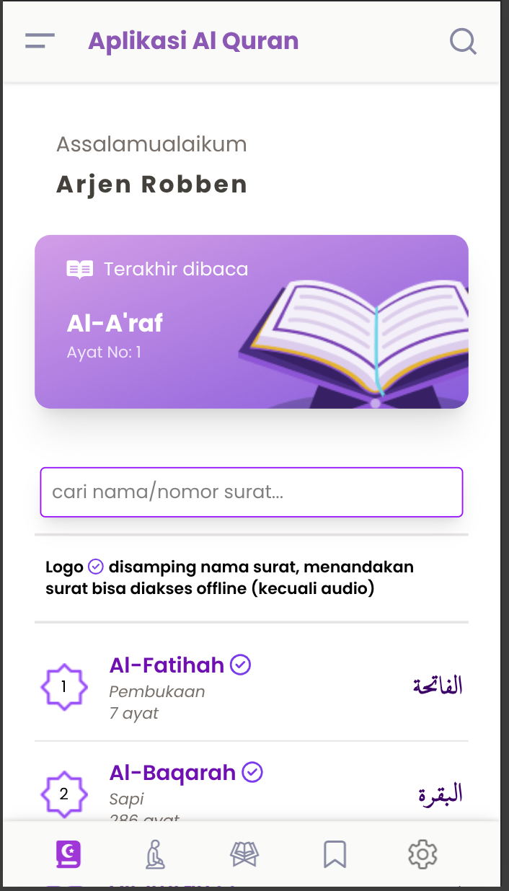
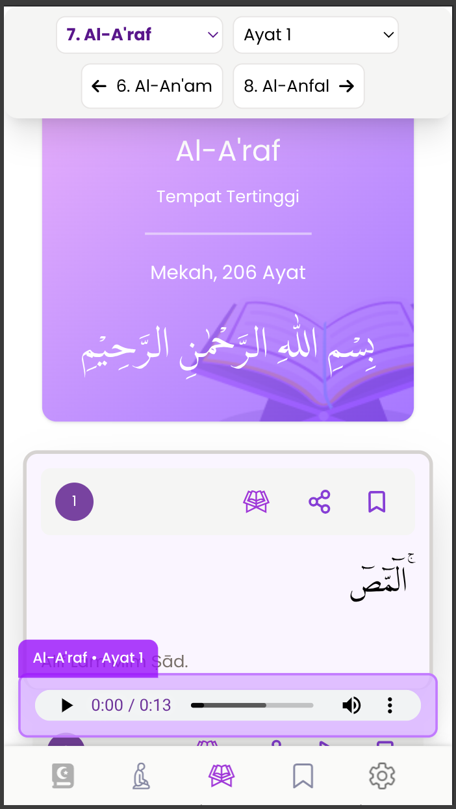
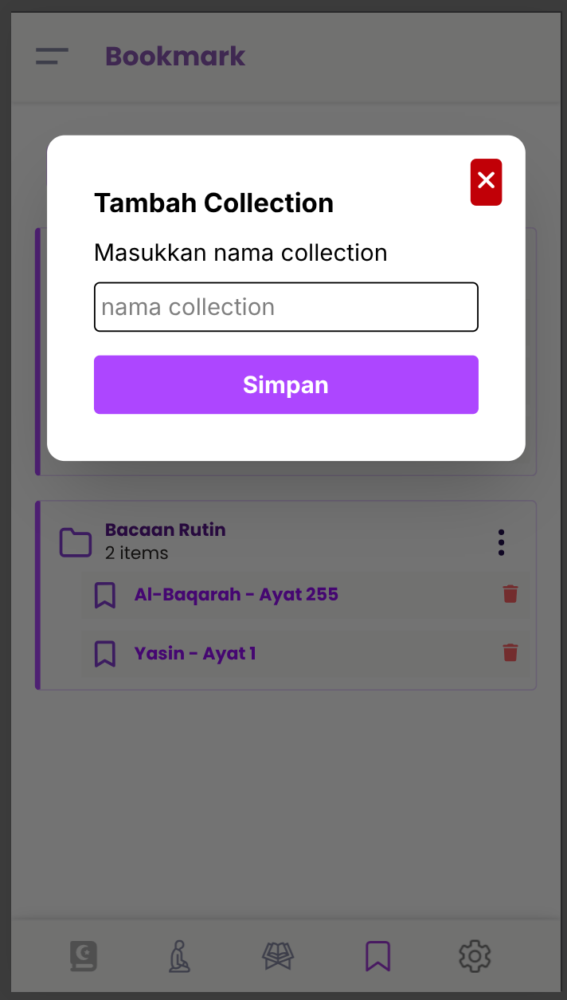
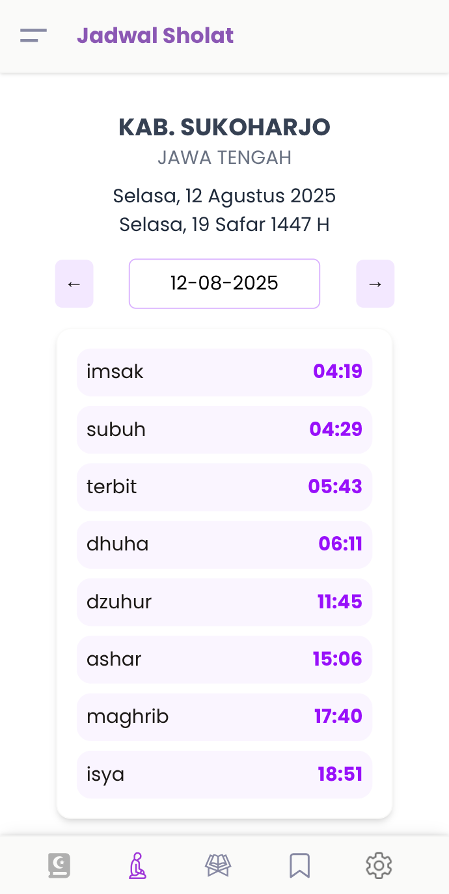
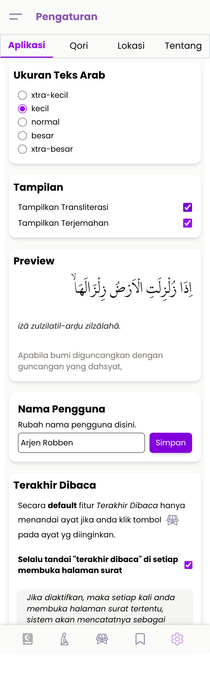

# Al-Quran Digital


Aplikasi Al-Quran Digital berbasis Progressive Web App (PWA) untuk membaca dan mempelajari Al-Quran dengan fitur lengkap dan antarmuka yang responsif.

🔗 **Demo Langsung**: [https://quran-frontend-zeta.vercel.app/](https://quran-frontend-zeta.vercel.app/)

## Tentang Proyek

Proyek ini merupakan aplikasi pembelajaran yang saya kembangkan untuk memperdalam pengetahuan tentang React dan ekosistemnya.

## Fitur Utama

### Membaca Al-Quran

- Teks Arab dengan transliterasi dan terjemahan Bahasa Indonesia
- Audio per ayat dari 5 pilihan qori terkenal
- Kustomisasi tampilan (ukuran font Arab, show/hide transliterasi dan terjemahan)

### Manajemen Bacaan

- Fitur "tandai terakhir dibaca" untuk melanjutkan bacaan
- Sistem bookmark lengkap dengan pengelompokan folder/collection
- Fitur berbagi ayat beserta transliterasi

### Fitur Tambahan

- Jadwal sholat berdasarkan lokasi kota pengguna(setting manual di aplikasi)
- Antarmuka responsif untuk mobile, tablet, dan desktop

### Teknologi

- **Progressive Web App (PWA)** - dapat diinstall seperti aplikasi native
- **Offline Support** - data surat tersimpan otomatis di localStorage (kecuali audio)
- **Responsive Design** - optimal di berbagai perangkat

## Tech Stack

**Frontend:**

- React 18 - Library JavaScript untuk membangun antarmuka pengguna
- React Router v7 - Routing untuk aplikasi single-page
- TailwindCSS - Framework CSS utility-first
- Vite - Build tool dan development server

**Libraries:**

- react-datepicker - Komponen pemilih tanggal untuk jadwal sholat
- vite-plugin-pwa - Plugin untuk dukungan Progressive Web App

**APIs:**

- [equran.id API v2](https://equran.id/apidev/v2) - Sumber data Al-Quran lengkap
- [Muslim API v2](https://documenter.getpostman.com/view/841292/2s9YsGittd) - Data jadwal sholat

## Desain & Inspirasi

- **UI/UX Design**: [Tanvir Ahassan](https://www.figma.com/@tanvirux) - dengan penyesuaian
- **Figma Source**: [Quran App Concept Free](https://www.figma.com/community/file/966921639679380402/quran-app-concept-free)
- **Inspirasi**: [Al-Ihsan Apps](https://github.com/emsifa/al-ihsan.app/) oleh [Muhammad Syifa](https://github.com/emsifa/)

## Prerequisites

Pastikan Anda memiliki software berikut terinstall:

- **Node.js** (versi 16 atau lebih tinggi)
- **pnpm** (recommended) atau npm
- Browser modern dengan dukungan PWA

## Instalasi Lokal

### 1. Clone Repository

```bash
git clone https://github.com/taufiq33/quran-frontend.git
cd quran-frontend
```

### 2. Install Dependencies

```bash
pnpm install
# atau menggunakan npm
npm install
```

### 3. Jalankan Development Server

```bash
pnpm run dev
# atau
npm run dev
```

Aplikasi akan berjalan di `http://localhost:5173`

### 4. Build untuk Production

```bash
pnpm run build
# atau
npm run build
```

## Cara Menggunakan

### Akses Online

Kunjungi langsung: [https://quran-frontend-zeta.vercel.app/](https://quran-frontend-zeta.vercel.app/)

### Install sebagai PWA

1. Buka aplikasi di browser mobile/desktop
2. Cari opsi "Add to Home Screen" atau "Install App"
3. Aplikasi akan terinstall seperti aplikasi native

### Pengaturan Jadwal Sholat

1. Masuk ke halaman **Pengaturan**, klik tab Lokasi.
2. Pilih kota/lokasi Anda
3. Jadwal sholat akan otomatis menyesuaikan lokasi

## Screenshots

<div align="center">

### Homepage & Navigation



### Reading Experience



### Bookmark Management



### Prayer Schedule & Settings

 

</div>

## Bug Reports & Feature Requests

Jika Anda menemukan bug atau memiliki ide untuk fitur baru, silahkan ajukan di menu Issue / Pull Request ya.

## Acknowledgments

Terima kasih kepada:

- Allah SWT atas segala kemudahan dan berkah
- [Muhammad Syifa](https://github.com/emsifa/) untuk inspirasi proyek
- [Tanvir Ahassan](https://www.figma.com/@tanvirux) untuk desain UI yang indah
- Tim [equran.id](https://equran.id/) untuk API Al-Quran yang lengkap
- Komunitas open source yang telah berkontribusi pada libraries yang digunakan

## Contact & Support

- **Kontak Telegram**: [@taufiq_h](https://t.me/taufiq_h)
- **GitHub**: [@taufiq33](https://github.com/taufiq33)
- **Project Link**: [https://github.com/taufiq33/quran-frontend](https://github.com/taufiq33/quran-frontend)
- **Live Demo**: [https://quran-frontend-zeta.vercel.app/](https://quran-frontend-zeta.vercel.app/)

---
